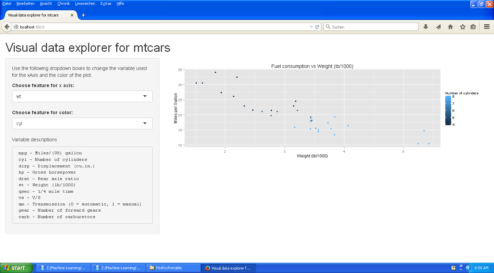

## Exploring the mtcars dataset with regard to fuel consumption

1. The mtcars dataset gives insights into cars from 1973/1974
2. The data was extracted from the 1974 Motor Trend US magazine, and comprises fuel consumption and 10 aspects of automobile design and performance
3. We have created a shiny app the let's you explore the dataset


```{r}
head(mtcars)
```


--- .class #id 

## We can create plots like this...

```{r echo=F, warning=F}
mtDescription <- c("Miles/(US) gallon", 
                        "Number of cylinders", 
                        "Displacement (cu.in.)",
                        "Gross horsepower",
                        "Rear axle ratio",
                        "Weight (lb/1000)",
                        "1/4 mile time",
                        "V/S",
                        "Transmission (0 = automatic, 1 = manual)",
                        "Number of forward gears",
                        "Number of carburetors")

      library(ggplot2)    
  
      xAxis <- "wt"
      theColor <- "cyl"

      input <- data.frame(xAxis, theColor)

      dat <- mtcars
      colNr <- which(colnames(dat) == input$xAxis)
    
      plot <- ggplot(dat, 
                     aes(x=dat[,colNr], y=mpg, color=dat[,input$theColor]),
                     , environment = environment()) + 
                     geom_point() + 
                     ylab("Miles per Gallon")  +
                     xlab(mtDescription[colNr]) + 
                     ggtitle(paste("Fuel consumption vs", mtDescription[colNr])) +
                     labs(colour = mtDescription[which(colnames(dat) == input$theColor)])
        
plot


```


---

## ... with a simple shiny app



---

## Slide 5

1. You can try it out yourself!
2. Goto http://awiloylf.shinyapps.io/DataScienceDataProducts1/


